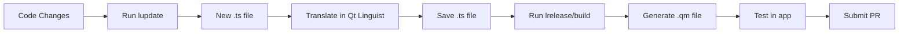

# Translation Guide

This guide explains how to contribute translations to VEIL VPN Client.

## Supported Languages

Currently, VEIL VPN Client supports the following languages:

- **English (en)** - Base language
- **Russian (ru)** - Russian
- **Chinese (zh)** - Simplified Chinese

## Translation Files

Translation files are located in `src/gui-client/translations/` directory:

- `veil_en.ts` - English (base language)
- `veil_ru.ts` - Russian
- `veil_zh.ts` - Chinese (Simplified)

## How to Add a New Translation

### 1. Update CMakeLists.txt

Add your new language to the translation files list in `src/gui-client/CMakeLists.txt`:

```cmake
set(TS_FILES
  translations/veil_en.ts
  translations/veil_ru.ts
  translations/veil_zh.ts
  translations/veil_YOUR_LANGUAGE.ts  # Add your language here
)
```

### 2. Generate Translation File

Run `lupdate` to generate a new translation file from the source code:

```bash
cd src/gui-client
lupdate *.cpp *.h -ts translations/veil_YOUR_LANGUAGE.ts
```

Replace `YOUR_LANGUAGE` with your language code (e.g., `fr` for French, `de` for German, `es` for Spanish).

### 3. Translate Strings

You can translate strings using one of the following methods:

#### Option A: Qt Linguist (Recommended)

Qt Linguist is a GUI tool that makes translation easy:

1. Install Qt Linguist (usually included with Qt development tools)
2. Open the `.ts` file in Qt Linguist
3. Translate each string in the UI
4. Save the file

```bash
linguist translations/veil_YOUR_LANGUAGE.ts
```

#### Option B: Manual Editing

You can also edit the `.ts` file manually in a text editor:

```xml
<message>
    <source>Connect</source>
    <translation>YOUR_TRANSLATION_HERE</translation>
</message>
```

### 4. Update Settings Widget

Add your language to the language selector in `src/gui-client/settings_widget.cpp`:

```cpp
languageCombo_->addItem("Your Language Name", "YOUR_LANGUAGE");
```

### 5. Update Main.cpp

Add your language code to the supported languages list in `src/gui-client/main.cpp`:

```cpp
QStringList supportedLanguages = {"en", "ru", "zh", "YOUR_LANGUAGE"};
```

### 6. Build and Test

Build the project to generate `.qm` files from your `.ts` files:

```bash
mkdir -p build
cd build
cmake ..
cmake --build .
```

The build system will automatically:
- Compile `.ts` files to `.qm` files
- Install `.qm` files to the correct location

### 7. Submit Pull Request

Once you've tested your translation:

1. Commit your changes
2. Push to your fork
3. Create a pull request with a description of your translation

## Updating Existing Translations

When the application code changes, translation files need to be updated:

### 1. Update Translation Source Files

Run `lupdate` to extract new strings from the source code:

```bash
cd src/gui-client
lupdate *.cpp *.h -ts translations/veil_en.ts translations/veil_ru.ts translations/veil_zh.ts
```

This will:
- Add new strings that need translation
- Mark obsolete strings
- Preserve existing translations

### 2. Translate New Strings

Open the `.ts` file in Qt Linguist or a text editor and translate any new strings marked as "unfinished".

### 3. Remove Obsolete Strings

Qt Linguist will show obsolete strings (strings no longer in the code). You can remove them to keep the file clean.

## Translation Best Practices

1. **Keep it concise**: UI space is limited, especially in buttons and labels
2. **Maintain context**: Understand what the string represents before translating
3. **Test in the UI**: Always test your translations in the actual application
4. **Use proper terminology**: Use standard VPN terminology in your language
5. **Preserve formatting**: Keep formatting characters like `%1`, `\n`, etc.
6. **Cultural adaptation**: Adapt idioms and phrases to your culture when appropriate

## Translation Placeholders

Some strings contain placeholders that will be replaced with values:

- `%1`, `%2`, etc. - Positional arguments
- `\n` - Newline character
- HTML tags - Keep HTML formatting intact

Example:
```xml
<source>Current version: %1</source>
<translation>当前版本：%1</translation>
```

## Testing Translations

### 1. Build the Application

```bash
mkdir -p build
cd build
cmake ..
cmake --build .
```

### 2. Run and Change Language

1. Run the application
2. Go to Settings → Advanced
3. Select your language from the dropdown
4. Click "Save Changes"
5. Restart the application
6. Verify all strings are translated correctly

### 3. Check for Issues

- Missing translations (English text appearing)
- Text overflow (translations too long for UI elements)
- Incorrect context (mistranslated due to lack of context)
- Formatting issues (broken HTML, missing placeholders)

## Continuous Integration

Translation files are automatically validated in CI:

- `.ts` files must be well-formed XML
- `.qm` files must be generated successfully
- No compilation warnings should be introduced

## Getting Help

If you need help with translations:

1. Check existing translations for examples
2. Open an issue on GitHub with the "translation" label
3. Ask in the discussions section

## Language-Specific Notes

### Russian (ru)

- Use formal "вы" for user-facing messages
- Follow Russian typography rules for punctuation
- Use Cyrillic equivalents for technical terms when available

### Chinese (zh)

- Use Simplified Chinese (简体中文)
- Keep translations concise due to character density
- Use appropriate technical terms from Chinese VPN domain

## Automated Translation Tools

While machine translation can help, please:

1. **Always review** automated translations
2. **Test in context** - machine translations often miss nuance
3. **Adjust for UI constraints** - auto-translations may be too long
4. **Use native speaker review** when possible

## Translation Workflow



## Credits

Thank you to all contributors who help translate VEIL VPN Client!

To add yourself as a translator, update this section with:
- Your name/username
- Language(s) you translated
- Date of contribution

---

**Note**: This is a community-driven effort. We appreciate all contributions to make VEIL VPN accessible to users worldwide!
